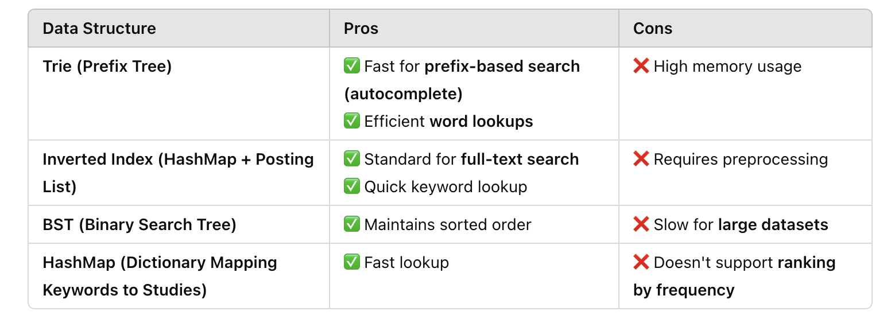

# System Design: Search Engine

## Overview: Scenario-Based DSA Problem (40 minutes)

This project implements a search engine that allows users to search for studies based on keywords. The search engine uses an inverted index to store and retrieve study titles that contain the given keywords.

💡 Scenario:
"You are building a feature for a research platform where users can search for past research studies they participated in. The search system must handle millions of queries efficiently. Each study has a unique study_id, a title, a category, and a description. Users should be able to:"

- Search studies by keyword (title or description)
- Get search results ranked by relevance (i.e., keyword frequency)
- Support autocomplete suggestions when users start typing

Your Task:

- Design a system to store and search studies efficiently.
- Choose the best data structure for fast search and ranking.
- Implement a function search_studies(keyword: str) -> List[str] that returns study titles matching the keyword.
- Optimize for fast lookups, considering scalability.

## Clarifications

I understand that this system is basically like a search engine. I have a couple of questions to clarify some things (how many searches per second do we want to have?, do we want to require the unique fields in search queries?). But I am mindful of the fact that we have 40 minutes, and I know that cannot be enough time to thoroughly complete all these tasks. Is there an aspect you'd like me to focus on first?

## 🎯 Prioritizing the Problem

You're absolutely right! We don’t have enough time to build everything, so let’s focus on:

✅ Step 1: Choosing the Right Data Structure for efficient search

✅ Step 2: Implementing search_studies(keyword: str) -> List[str]

✅ Step 3 (if time permits): Adding autocomplete functionality.



Inverted Index is how search engines work. Trie is useful for autocomplete if we have time later.

## The Design

Since this system behaves like a search engine, we need a design that supports fast lookups, filtering, ranking, and scalability. Instead of just storing studies in a traditional database, we should optimize for search efficiency and retrieval speed.

### 🎯 Step 1: Understanding the Requirements

📌 Before choosing a data store, let’s break down our core functional needs:

- Keyword-Based Search → Users should be able to search by title, description, or keywords.
- Filtering by Category → Every study belongs to a unique category, so we need efficient category-based filtering.
- Autocomplete → The system should provide real-time suggestions when users start typing.
- Scalability → The search system should support millions of studies and handle high query loads.
- Ranking by Relevance → More relevant results should appear higher in the search results.

📌 Given these requirements, we need to choose the right data store.

### 💾 Step 2: Choosing the Right Storage Solution

💡 "We have two main options: a relational database (SQL) or a specialized search engine (NoSQL or full-text search database)."


Given that we need a high-performance search system, we should use Elasticsearch as the primary search engine, supported by Redis for autocomplete. This setup provides fast full-text search, ranking, and real-time suggestions.

### 🛠 Step 3: Designing the Data Model

💡 "Now that we’ve picked Elasticsearch, we need to define our document schema."

📌 Study Document Structure (Stored in Elasticsearch)

```json
{
  "study_id": 1,
  "title": "Machine Learning in Psychology",
  "description": "Understanding cognition using ML",
  "category": "Cognitive Science",
  "keywords": ["machine learning", "cognition", "psychology"],
  "timestamp": "2024-02-10T12:00:00Z"
}
```

✔ Why this structure?

- The keywords field improves search relevance.
- The category field allows efficient filtering.
- The timestamp field enables sorting by recency.

📌 Indexing Strategy in Elasticsearch

- Title & description → Full-text search
- Category → Keyword-based filtering
- Timestamp → Sorting by recency

### Step 4: Implementing Search Functionality and Step 5: Handling Autocomplete with Redis Trie

These are handled in the code file: [`search_studies.py`](search_studies.py)

## 💡 Where Are We Using the Inverted Index?

✅ Inverted Index is a key part of Elasticsearch's search mechanism.

An inverted index is how search engines quickly find documents that contain a specific keyword. Instead of scanning every study, we precompute a mapping of words to document locations, allowing us to retrieve results in near-instant time.

📌 How Elasticsearch Uses an Inverted Index:

1️⃣ When a study is added → Elasticsearch tokenizes its title, description, and keywords into separate words and builds an inverted index.

2️⃣ When a user searches for a word → Elasticsearch looks up the precomputed index instead of scanning all documents.

3️⃣ Ranking happens next → Using BM25 (TF-IDF variant), results are ranked by relevance.


## 🚀 How to Scale the Study Search System for Millions of Studies

Now that we have a search system based on Elasticsearch and Redis for autocomplete, let’s discuss how to scale it efficiently.

1️⃣ Scaling Data Storage & Indexing
📌 Problem:

Millions of studies mean our Elasticsearch index and Redis Trie will grow significantly.
If not optimized, indexing large datasets will be slow and queries will take longer.
📌 Solution:

✅ Sharding in Elasticsearch → Distribute the index across multiple nodes

✅ Tiered Storage → Keep frequently accessed studies in fast SSD storage

✅ Bulk Indexing → Process large updates efficiently

💡 Implementation Strategy:

Instead of one massive Elasticsearch index, we split it into shards based on category or time period.
Use hot-warm-cold architecture:
Hot tier → Recent studies (fast SSD storage, high availability)
Warm tier → Less frequent queries (stored on HDDs but still accessible)
Cold tier → Archival studies (cheaper storage, long-term retention)
📌 Elasticsearch Sharding Example

```json
{
  "settings": {
    "number_of_shards": 5,
    "number_of_replicas": 2
  }
}
```

🔥 This ensures data is evenly distributed and improves query speed by parallelizing searches across nodes.

2️⃣ Scaling Query Performance

📌 Problem:

As the dataset grows, full-text queries will become slower due to large index sizes.
The system should support low-latency queries (~50ms response time).

📌 Solution:

✅ Precompute search rankings using BM25 scoring

✅ Use query caching to reduce redundant searches

✅ Optimize Elasticsearch mapping (disable unused fields, use lightweight indexing)

💡 Implementation Strategy:

Enable Elasticsearch query caching for frequently searched terms.
Use approximate nearest neighbor (ANN) search instead of full-text scan.
Apply query rewriting:
Instead of searching "machine learning cognition psychology," convert it to:

```json

{
  "query": {
    "bool": {
      "must": [
        { "match": { "title": "machine learning" }},
        { "match": { "description": "cognition psychology" }}
      ]
    }
  }
}
```

This makes search queries faster by breaking them into smaller, more relevant parts.
3️⃣ Scaling Autocomplete with Redis
📌 Problem:

Autocomplete queries happen before the user submits a full search.
The Redis Trie structure will get very large with millions of entries.
📌 Solution:
✅ Partition Redis by category to reduce lookup time
✅ Evict old autocomplete suggestions that are rarely used
✅ Use a compressed prefix tree to store data efficiently

💡 Implementation Strategy:

Instead of one giant Redis instance, store study titles based on category

```yaml

Redis Trie Partitions:
├── Cognitive Science
├── Machine Learning
├── Behavioral Neuroscience
```
Use Redis LRU (Least Recently Used) eviction to remove unpopular suggestions.
4️⃣ Scaling Traffic Handling
📌 Problem:

A surge in users (e.g., peak research periods) could overload the system.
API rate limiting is needed to prevent abuse.
📌 Solution:
✅ Load Balancing (Nginx, AWS ALB) to distribute traffic
✅ Rate Limiting using API Gateway (e.g., only 5 requests per second per user)
✅ Circuit Breakers to stop queries if Elasticsearch/Redis slow down

💡 Implementation Strategy:

```json

{
  "rate_limit": {
    "requests_per_second": 5,
    "burst_limit": 10
  }
}
```

🔥 This prevents any single user from overloading the system!

5️⃣ Ensuring High Availability & Fault Tolerance
📌 Problem:

If an Elasticsearch node crashes, we can’t afford downtime.
Failover & redundancy are critical.
📌 Solution:
✅ Multi-region replication → Store copies of indexes in different regions
✅ Auto-healing clusters → Use Kubernetes to restart failed services
✅ Backup strategies → Nightly backups of Elasticsearch & Redis

💡 Implementation Strategy:

```yaml

replicas: 3  # Run 3 Elasticsearch instances
antiAffinity: preferred  # Spread across multiple machines
```
🔥 This ensures no single failure takes down the system!

### 🎯 Final Scalable Architecture

```pgsql

           User Query
               │
      ┌───────┴────────┐
      │                │
  Full-Text Search    Autocomplete
 (Elasticsearch)      (Redis Trie)
      │                │
  Load Balanced     Partitioned Index
   API Gateway
      │
  Sharded Indexing
(Elasticsearch Cluster)
      │
  Multi-Region Replication
```
🚀 Final Answer Summary
📌 To scale for millions of studies, we:
✅ Use Elasticsearch sharding to distribute data across multiple nodes
✅ Optimize query performance with caching & query rewriting
✅ Partition Redis for autocomplete and use LRU eviction
✅ Implement load balancing & rate limiting for API protection
✅ Ensure fault tolerance with multi-region replication

🔥 This keeps our system fast, scalable, and highly available!